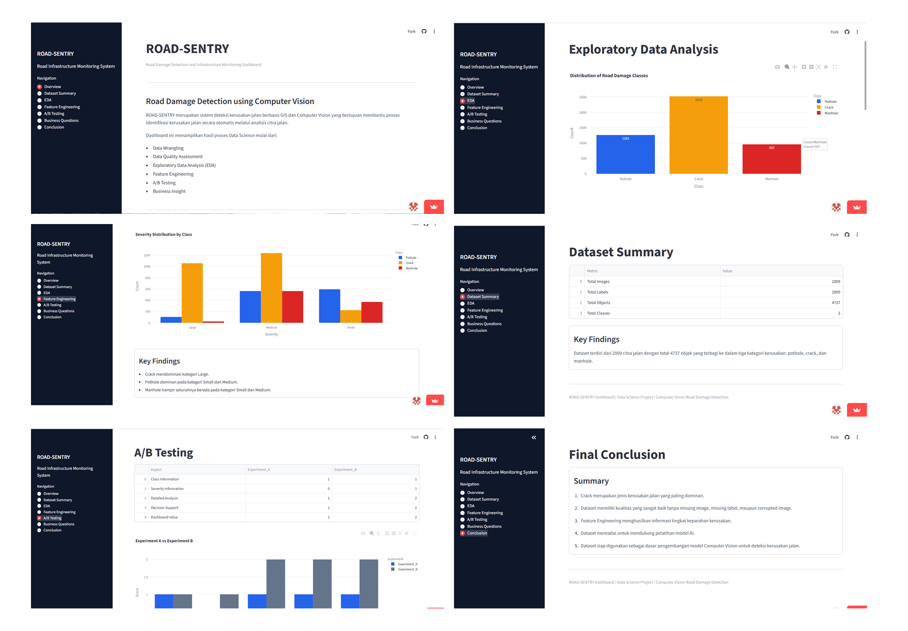

<div align="center">
  
# Streamlit Dashboard Road-Sentry

### Interactive Data Analytics Dashboard for Road Damage Dataset Analysis

An interactive dashboard built with Python, Streamlit, Pandas, NumPy, and Plotly to explore, analyze, and visualize the road damage dataset used in the ROAD-SENTRY project.


</div>

---

## Overview

Streamlit Dashboard ROAD-SENTRY is an interactive data analytics application developed to explore, analyze, and validate the road damage dataset used in the ROAD-SENTRY project.

The dashboard provides a complete end-to-end analytical workflow, covering Data Wrangling, Data Quality Assessment, Exploratory Data Analysis (EDA), Feature Engineering, A/B Testing, Business Questions, and Final Conclusions. Through interactive visualizations and statistical summaries, the dashboard transforms processed datasets into actionable insights that support the development of Computer Vision models for automated road damage detection.

> Note: This repository focuses on the **Data Analytics** stage of the ROAD-SENTRY project and does **not** include the AI model or GIS application.

---

## Link Streamlit Dashboard

- https://dashboard-road-sentry-gnb4nytjo5fhnj72to3xak.streamlit.app/

## Dashboard Preview

<p align="center">
  
</p>
<p align="center">
  
</p>

---

## Features

### Dashboard Overview

Displays key dataset statistics through interactive KPI cards.

| Metric | Value |
|---------|------:|
| Total Images | **2,009** |
| Annotated Objects | **4,737** |
| Damage Classes | **3** |
| Data Quality Score | **100%** |

---

### Dataset Summary

Provides descriptive statistics and an overview of the processed dataset.

---

### Exploratory Data Analysis (EDA)

Interactive visualizations for exploring dataset characteristics, including:

- Damage class distribution
- Object frequency
- Dataset composition
- Statistical summaries

---
## Feature Engineering

### Bounding Box Statistics

- Distribution of bounding box areas
- Object size analysis
- Area statistics

### Damage Severity Distribution

Categorizes road damage into:

- Small
- Medium
- Large

---

## A/B Testing

ompares analytical approaches before and after Feature Engineering to evaluate the impact of additional severity information.


| Experiment | Description |
|------------|-------------|
| **Experiment A** | Analysis using damage class information only |
| **Experiment B** | Analysis using both damage class and generated severity features |

#### Key Findings

- Feature Engineering introduces additional severity information that enriches the dataset.
- The inclusion of severity features provides deeper analytical insights than using damage classes alone.
- Enhanced feature representation improves dataset interpretability and supports better decision-making during AI model development.

---

## Business Questions

Answers key analytical questions derived from the dataset and presents the corresponding insights.

### 1. How are road damage types distributed within the dataset?

Analysis shows that Crack is the most dominant damage type, followed by Pothole and Manhole.

---

### 2. Does the dataset satisfy the required data quality for AI model development?

Based on the Data Quality Assessment:

- ✅ No missing images
- ✅ No missing labels
- ✅ No corrupted images

The dataset achieves a 100% Data Quality Score.

---

### 3. Is the dataset suitable for Road-Sentry AI model training?

Yes.

The dataset contains:

- Sufficient image samples
- Complete object annotations
- Clear class distribution
- Additional severity information

making it suitable for Computer Vision model development.

---

### Key Insights

- Crack is the dominant road damage category.
- Dataset quality is excellent with no missing or corrupted data.
- Feature Engineering successfully enriches the dataset with severity information.
- Class distribution supports supervised machine learning.
- The dataset is ready for Computer Vision model training.

---

## Final Conclusion

The analysis demonstrates that the ROAD-SENTRY dataset has excellent quality and is ready to support AI model development.

### Summary

- Crack is the most dominant road damage type.
- No missing images, labels, or corrupted files were detected.
- Feature Engineering provides additional severity information.
- Dataset characteristics are sufficient for machine learning.
- The dataset is ready to be used as the foundation for Computer Vision-based road damage detection.

---

## Technology Stack

| Category | Technology |
|----------|------------|
| Language | Python |
| Framework | Streamlit |
| Data Processing | Pandas, NumPy |
| Visualization | Plotly |

---
## Data Analytics Workflow

```text
Raw Dataset
      │
      ▼
Data Wrangling
      │
      ▼
Data Quality Assessment
      │
      ▼
Exploratory Data Analysis
      │
      ▼
Feature Engineering
      │
      ▼
A/B Testing
      │
      ▼
Business Insights
      │
      ▼
Final Conclusion
```

---

## Project Structure

```text
streamlit-dashboard-road-sentry/
│
├── app1.py
├── requirements.txt
├── dataset_summary.csv
├── class_distribution.csv
├── severity_distribution.csv
├── severity_class.csv
├── ab_testing_summary.csv
└── README.md
```

---

## Installation

Clone the repository.

```bash
git clone https://github.com/fardhoz25/streamlit-dashboard-road-sentry.git
```

Move into the project directory.

```bash
cd streamlit-dashboard-road-sentry
```

Install the required packages.

```bash
pip install -r requirements.txt
```

Run the Streamlit application.

```bash
streamlit run app1.py
```

---
## Skills Demonstrated

- Data Cleaning
- Data Wrangling
- Data Quality Assessment
- Exploratory Data Analysis (EDA)
- Feature Engineering
- Statistical Analysis
- Data Visualization
- Interactive Dashboard Development
- Business Insight Generation
- Python Data Analytics

---

## Future Improvements

- Export dashboard reports (PDF/Excel)
- Additional analytical metrics and KPIs
- Time-series analysis for larger datasets
- Multi-dataset comparison
- User authentication and role management
- Cloud deployment for public access

---

## License


This project is licensed under the **MIT License**.

See the [LICENSE](LICENSE) file for details.

---

## Author

**Fardho Zurrahman**

---

Feel free to ⭐ this repository if you find it useful!
